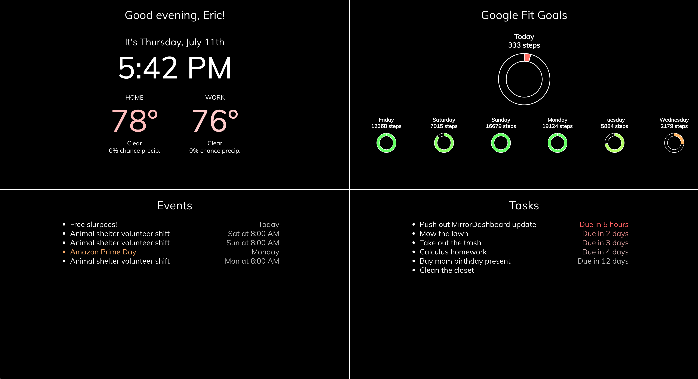

# Mirror Dashboard
A clean, simple UI for Magic Mirrors

-----
Developed by Eric

View more of my projects at [yoonicode.com](http://yoonicode.com)

## Core Features
The MirrorDashboard features 4 modules in each quadrant of the screen.

**📍Now** Features the date, time, and weather information via DarkSky API. You can view the weather at home and at a secondary location (work, school, etc)

**🏃‍Google Fit** Keep track of your Google Fit goals for the past week with beautiful donut charts, right on your mirror.

**📅Google Calendar** See what your day is going to look like.

**✅Google Tasks** Stay on top of your tasks from your Mirror. 

## Raspberry Pi Installation
Many people install their Magic Mirror software on Raspberry Pi. Luckily, there is RasPi-specific documentation, [right here on the Wiki](https://github.com/yummypasta/MirrorDashboard/wiki/Raspberry-Pi-Installation-and-Configuration).

## Setup and Installation
### Download and Installation
Clone this repository to whatever machine you want the Mirror to run on.

    cd ~/Desktop    # or any directory you want the folder to be in        
    git clone https://github.com/yummypasta/MirrorDashboard.git

A new directory called MirrorDashboard will appear.

    cd MirrorDashboard

#### Updating
To update the repository, just execute the command in the MirrorDashboard directory:

    git pull
If you haven't made changes to the source code, this shouldn't create any merge conflicts.

## Configuration
Some configuration of MirrorDashboard is required. You will have to sign up for a Google account and a Dark Sky account for the mirror to function.

### Google APIs
1. Sign up for a Google account if you don't have one already.
2. Create a new project on the [Google Cloud website](https://cloud.google.com).
3. In the [API library](https://console.cloud.google.com/apis/library), enable to Google Fit, Google Tasks, and Google Calendar APIs.
4. Create an API key on the [credentials page](https://console.cloud.google.com/apis/credentials). Copy the "key" string; you will need it later. This string is called the Google API Key.
5. Create an OAuth Client ID. You will get another string labeled "Client ID"; we will call this the Google Client ID.

### Dark Sky API
1. Sign up for a Dark Sky Developer account [on the website](https://darksky.net/dev/login).
2. Make note of the Secret Key on your dashboard.

### Config File
Duplicate the file `src/CONFIG_TEMPLATE.js` and rename the copy `src/config.js`.
Do not edit `CONFIG_TEMPLATE.js`, or else it may cause conflicts when updating. You may have to copy over some variables if the config template is ever updated.

Now, we must add some parameters to the config file.

| Variable | Value | Type
|---|---|---
| apiKey | The Google API key from before. | string 
| clientId | The Google Client ID from before. Will probably look something like `<Random String>.apps.googleusercontent.com` | string 
| darkSkyKey | The DarkSky Secret Key from before. | string 
| secondaryLocation | Where do you commute to? Will usually be `work`, `school`, etc. (Will be `toUpperCase()`d) | string 
| homeLatitude | The latitude coordinate of the Magic Mirror (used for weather). | decimal number 
| homeLongitude | The longitude coordinate of the Magic Mirror (used for weather). | decimal number 
| workLatitude | The latitude coordinate of the place you commute to. | decimal number 
| workLongitude | The longitude coordinate of the place you commute to. | decimal number 
| calendars | The Google Calendar ID of any calendars you want to display on the mirror. You can find this under the **Integrate Calendar** section in the calendar settings. | string[]
| calendarLookAhead | How many days in advance an event should be shown. | integer
| maxEntries | The maximum number of calendar events and tasks to display. | integer
| taskLists | The IDs of the Google Tasks lists to show. Find IDs [here](https://developers.google.com/tasks/v1/reference/tasklists/list). | string[]
| googleFitActivity | A "data type for instantaneous reading", as described on the [Google Developers Website](https://developers.google.com/fit/android/data-types). | string
| googleFitActivityUnits | The unit of the above data type, to be displayed on the mirror. | string
| fitGoal | Your Google Fit goal, or how many (steps/calories/miles etc) it takes to fill up the donut charts. |

There are additional options that you usually can leave alone, but are customizable to each user's needs.

| Variable | Value | Type
|---|---|---
| googleAuthScopes | Any OAuth scopes the mirror needs to access, defined in [this list](https://developers.google.com/identity/protocols/googlescopes). Depending on your `googleFitActivity`, you may need to add additional [fitness scopes](https://developers.google.com/identity/protocols/googlescopes#fitnessv1). | string, with each scope delimited by a space
| refreshRates | How often each widget should refresh | See table below |

`refreshRates` is a Javascript Object Dictionary with the following entries.

| Key | Value | Type
|---|---|---
| weather | How often the weather widget should refresh, in milliseconds. Each weather refresh is 2 DarkSky API calls, and DarkSky currently imposes a limit of 1000 calls per day. | number
| fit | How often the Google Fit widget should refresh, in milliseconds. | number
| calendar | How often the Google Calendar widget should refresh, in milliseconds. One Google API request is made for each calendar, every refresh. | number
| tasks | How often the Google Calendar widget should refresh, in milliseconds. One Google API request is made for each task list, every refresh. | number

### Build
After you make any changes to `config.js` (or any other sourcecode file for that matter), you must re-build the mirror software.

First, you may need to install Node and NPM. You can get it from the [official website](https://nodejs.org).

If this is your first time building this download/clone of MirrorDashboard, run the following command from the MirrorDashboard directory:

    npm install

This installs any necessary dependencies for your clone.

Once that finishes installing, build the actual webpage you will open:

    npm run build

the `build` directory should appear. You're ready to use your mirror!

**IMPORTANT!** Do not distribute your build folder to the Internet, as your configuration and API keys is baked in. 

## Running MirrorDashboard
After you build your mirror for the first time, you can _finally_ use it!

Unfortunately, you can't directly open the `index.html` file in your favorite browser. However, there is a handy script available to you!

If it's your first time starting MirrorDashboard, you may need to allow your machine to execute the start script. Within the MirrorDashboard directory, run:

    sudo chmod +x start.sh

The start script will first serve the `build` directory then open the Chromium browser. If you don't already, install it [here](https://www.chromium.org/getting-involved/download-chromium).
By default, it will open Chromium in kiosk mode, making it mildly annoying to exit. If the device you are starting MirrorDashboard on is not a dedicated computer, remove `--kiosk` from the script. If you want it to start in a window of Chromium, also remove the `--start-fullscreen` flag.

Finally, globally install the serve command:

    npm install serve -g

**Any time you want to start your mirror, `cd` into the MirrorDashboard directory, then run the `start.sh` script using the command:**

    ./start.sh

After you sign in with Google, you should be all set!

## How To Contribute
### Code Edits

MirrorDashboard uses React. You can start a development server using:

    npm start

There are currently no strictly-enforced code style standards, and I welcome and encourage all Pull Requests!

The `master` branch is the current version of MirrorDashboard that is pushed out to users.

The `development` branch is the next release that is being developed on. One pull request will be sent from the `development` branch to the `master` branch once a release is ready. **Please send all pull requests to the development branch.**

### Issues, Feedback, and Bug Reports
Found any issues, have any feature requests, but haven't had time to implement them? Create an issue on Github, and I will review it and possibly add it to the code.

Have any other concerns? Feel free to email me at eric@yoonicode.com.

## Contributors
#### Main Design and Development
Eric Yoon

yoonicode.com

##### Code Contributors and Pull Requesters
None yet! I encourage everyone to take a peek at the source code and help out!

##### Feature Suggesters and Bug Reporters
None yet, but you can be the first!
